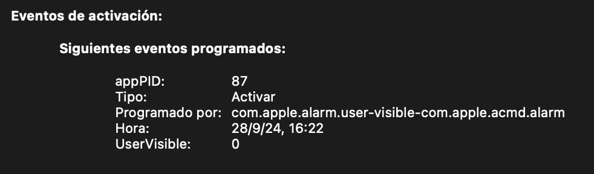
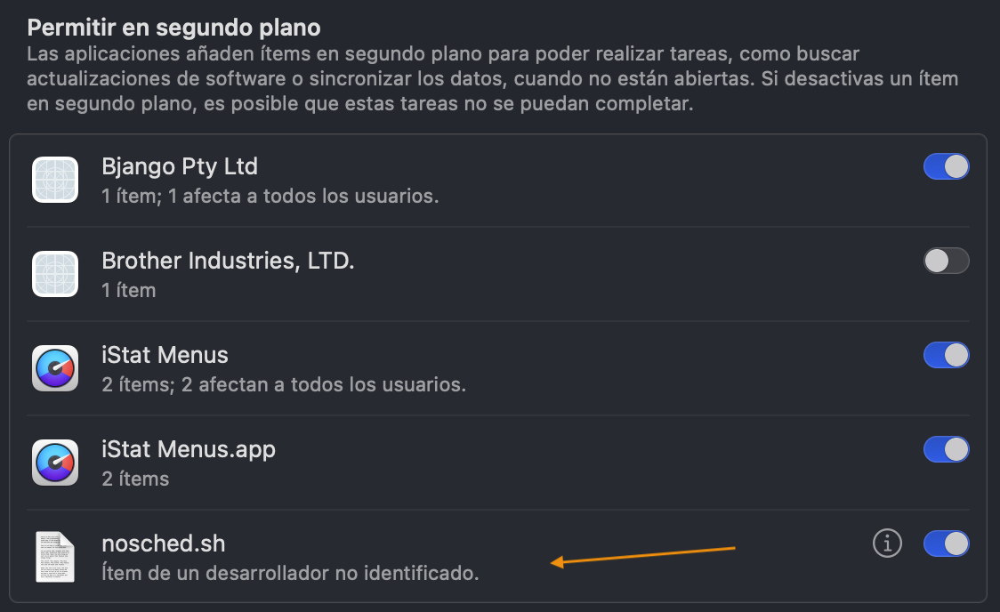

## macOS 15 Sequoia does not enter sleep mode properly

My system (Z390 Aorus Elite + i9-9900K + RX 6600 XT) running macOS 15 Sequoia doesn't always go to sleep as expected. Sometimes it does, turning off lights and fans, but other times it doesn't. This happens with the same `pmset` settings I use on macOS 14 Sonoma and macOS 13 Ventura where the system goes to sleep normally.
 
There are 2 situations that can cause this behavior:
 
1.- System Information >> Power >> Wake Events: sleep usually fails when there are Scheduled Events that can be generated by different processes com.apple.alarm dependent (they are Wake Type). These events can be deleted with the command `sudo pmset schedule cancelall`



2.- `apsd` process (Apple Push Notification Services Daemon): when active, sleep usually fails. This process seems to be related to notifications from various applications and services. It can be stopped with one of these commands:

```bash
sudo launchctl unload -w /System/Library/LaunchDaemons/com.apple.apsd.plist
###
sudo launchctl bootout -w /System/Library/LaunchDaemons/com.apple.apsd.plist
```

In my system, scheduled events seem to affect sleep more than `apsd` process. Sleep frequently fails when there are scheduled events but usually works fine without disabling `apsd`. However, there are comments on forums by users who do not fix this issue until they act on `apsd`.

Therefore, my recommendation is to cancel scheduled events first, test if the system enters and exits sleep as it should and disable `apsd` only as a secondary resource if sleep continues to fail. Adding to this, cancellation of scheduled events can be done without modifying the SIP value but disabling `apsd` forces you to work with SIP partially disabled.
 
### launchd process
 
macOS uses `launchd` to manage daemons and agents (tasks, processes or resident programs that run in the background without user interaction), and you can use it to run shell scripts. You cannot interact with `launchd` directly; you must use the `launchctl` command to start and stop daemons and agents. During boot, `launchd` is the first process that the kernel runs.

Here are the places where macOS stores the configuration files for these background processes:

- `/System/Library/LaunchDaemons`: System daemons installed by Apple, protected folder
- `/System/Library/LaunchAgents`: Agents installed by Apple, protected folder
- `/Library/LaunchDaemons`: System daemons added by other applications
- `/Library/LaunchAgents`: Agents added by other applications
- `~/Library/LaunchAgents`: Agents added by other applications that apply only to the logged in user.

It is possible to create `launchctl` controlled tasks with plist files located in the `/Library/LaunchAgents`, `/Library/LaunchDaemons` or `~/Library/LaunchAgent`s folders. One important difference is that tasks existing in `/Library/LaunchDaemons` can be run as root but those in the `LaunchAgents` folders are run as the logged in user.

I have created a task that is launched every so often by running the commands (clear scheduled events and stop apsd). Since both commands require sudo, the plist file has to be placed in `/Library/LaunchDaemons`. The following is a guide on how I did it. There is a lot of information about this on the Internet, I will limit myself to describing my personal experience as it applies to sleep mode on macOS Sequoia.
 
### Cancel scheduled events
 
1.- Create a shell script and save it as `nosched.sh`:

```bash
#!/bin/zsh
sudo pmset schedule cancelall
#sudo launchctl unload -w /System/Library/LaunchDaemons/com.apple.apsd.plist
```

2.- Copy it to /usr/local/bin:
`sudo cp /Users/yo/Desktop/LaunchDaemons/nosched.sh /usr/local/bin`

3.- Make root the owner of the file:
`sudo chown root:wheel /usr/local/bin/nosched.sh`

4.- Create a plist file and save it as com.user.nosched.plist:

```xml
<?xml version="1.0" encoding="UTF-8"?>
<!DOCTYPE plist PUBLIC "-//Apple//DTD PLIST 1.0//EN" "http://www.apple.com/DTDs/PropertyList-1.0.dtd">
<plist version="1.0">
<dict>
    <key>Label</key>
    <string>com.user.nosched</string>
    <key>ProgramArguments</key>
    <array>
        <string>/usr/local/bin/nosched.sh</string>
    </array>
    <key>RunAtLoad</key>
    <true/>
    <key>StartInterval</key>
    <integer>300</integer>
    <key>KeepAlive</key>
    <true/>
</dict>
</plist>
```
In this file we have:

- Label: label that must match the file name without the .plist extension
- ProgramArguments: the command or file to be executed
- RunAtLoad: activate from boot
- StartInterval: time interval in seconds between executions
- KeepAlive: keep alive.

5.- Copy it to /Library/LaunchDaemons. It has already been mentioned that the plist files in `/Library/LaunchDaemons` folder can be executed as root but those in `/Library/LaunchAgents` folder are executed as the active user.

`sudo cp /Users/yo/Desktop/LaunchDaemons/com.user.nosched.plist /Library/LaunchDaemons`

6.- Make root the owner of the file:

`sudo chown root:wheel /Library/LaunchDaemons/com.user.nosched.plist`

### Deactivating apsd process
 
Remember to do this only if method 1 is not enough and/or you verify that, with `apsd` inactive, sleep works fine.
 
Regarding the `apsd` process, `/System/Library/LaunchDaemons/com.apple.apsd.plist` already exists but `/System` folder is protected and macOS does not allow to write it so, in order to stop `apsd`, it is necessary to run SIP (partially) disabled.
 
You can use the SIP settings required by OCLP root-patch, `csr-active-config=03080000`  in OpenCore's config.plist (`0x803` in Clover). This setting returns Unknown state when running `csrutil status `in Terminal and the security variables it disables are:

``` 
CSR_ALLOW_UNTRUSTED_KEXTS      - 0x1 (1) 
CSR_ALLOW_UNRESTRICTED_FS      - 0x2 (2) 
CSR_ALLOW_UNAUTHENTICATED_ROOT - 0x800 (2,048)
```

The nosched.sh file must be modified to uncomment the command that disables apsd:

```bash
#!/bin/zsh
sudo pmset schedule cancelall
sudo launchctl unload -w /System/Library/LaunchDaemons/com.apple.apsd.plist
```

### Starting the task

Regarding scheduled events, you can start the task to be run in the background with one of these commands (in my case both seem to work well):

```
sudo launchctl load /Library/LaunchDaemons/com.user.nosched.plist

sudo launchctl start /Library/LaunchDaemons/com.user.nosched.plist
```

Regarding `apsd`, after rebooting (with the relaxed SIP value) the `apsd` process stops interfering with sleep.
 
If `launchctl load` gives you this error:

```
Load failed: 5: Input/output error
Try running launchctl bootstrap as root for richer errors
```

Use `launchctl bootstrap` to get detailed information about the reason for the error:

`sudo launchctl bootstrap /Library/LaunchDaemons/com.user.nosched.plist`

To see if the task is started (com.user.nosched must be present):

```bash
sudo launchctl list | grep com.user.nosched
- 0 com.user.nosched
```

To see if `apsd` is no longer active (command returns nothing if com.apple.apsd is stopped):

`sudo launchctl list | grep com.apple.apsd`

You can now configure Power Saver with `pmset` command. Example:

`sudo pmset displaysleep 1;sudo pmset disksleep 2;sudo pmset sleep 6`

The shell script appears in Startup Items (System Settings >> General).


